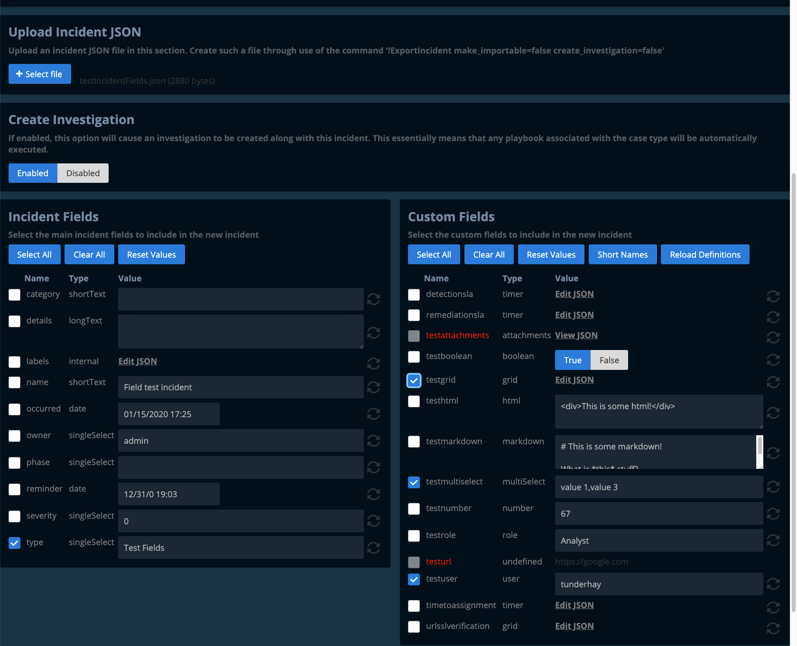
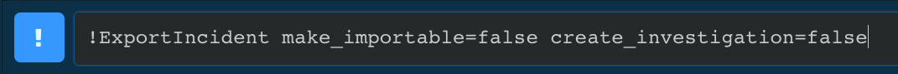
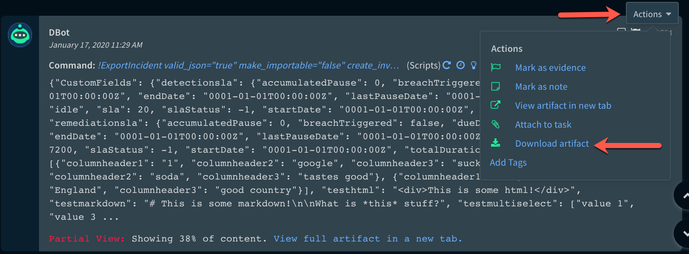
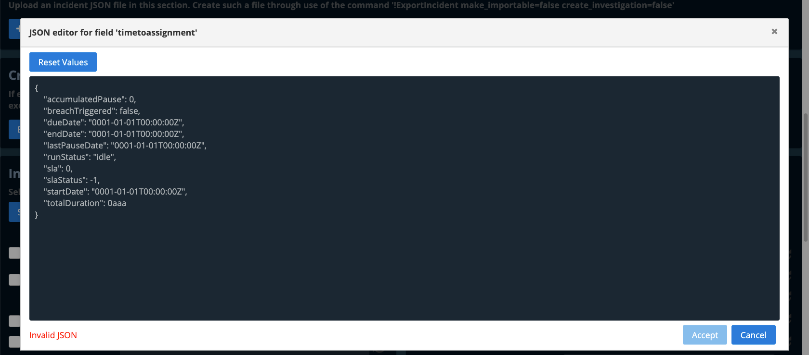

# Demisto Incident Importer

This web application will import incidents into Demisto over the Demisto REST API, using incident fields.  These incidents are incidents which have been exported from Demisto.  It allows for:

- Selection of which incident fields to import.
- The ability to edit field values, including JSON.
- It will also prohibit the import of fields which are not defined in Demisto,
- Bulk incident creation...
- To one or more Demisto servers

### Why would I use this?

- I'm writing/testing a Demisto playbook and I need to create incidents for testing
- I'm a Demisto SE or SA and I need to easily create demo incidents without the headache of configuring integrations, 3rd-party products, and ingesting the incidents.  As anyone who has tried sending emails for creating demo incidents well knows, this can consume hours of time in mucking about with email security, spam and malware filters, and other bother.
- I'm running a Demisto workshop or training exercise and need the ability to push incidents to multiple Demisto servers quickly.

## Exporting an Incident from Demisto

Run this command from within an incident war room in Demisto.  Note that it is not yet part of Demisto content -- you can find it in the `automations/` subdirectory in this repository):

`!ExportIncident make_importable=false create_investigation=false`

This will create a JSON dump of the current incident's fields.  Save the output to a file with a .txt or .json extension.

## Editing JSON

This app provides a text-style JSON editor for JSON-type incident fields.  The JSON must be well-formatted in order to be accepted.

## Running for the First Time

The client is not distributed in pre-built form, so to run it for the first time, one must either start the Angular client in development mode or build the client using the below instructions.  If running in development mode, this means that one will have two servers running - both the Node.js server and the Angular compiler / server.

1.  Install Node.js.  This is beyond the scope of this Readme.
2.  Clone this repository by running `git clone https://github.com/tundisto/demisto-incident-importer.git`.
2.  Install all necessary packages by running `npm install && cd server && npm install && cd ..` from the cloned repo's directory.
3.  Start the Node.js server by running `npm run server`.
4.  In a separate terminal, start the Angular compiler using `npm start`.

### Demisto API Key

Before this app can be used, An API key must first be generated within Demisto. using `Settings -> Integrations -> API Keys -> Get Your Key`.  Enter this key and the server infornation into the Demisto Servers section of the app.

## Running the Node.js server

Run `npm run server` to start the Node.js server.  If the `dist/` subdirectory is found, the pre-compiled Angular application will be served statically from it.  If `dist/` isn't found, it will run in development mode by proxying the Angular development server.

## Running the Node.js server in development mode

Use `npm run server-dev` to run the server in development mode, which will only proxy the Angular development server, rather than serving `dist/` statically.

## Running the Angular client in development mode

Run `npm start` to start the Angular client app in development mode, allowing live-reload if making changes to the client source (in the `src/` subdirectory).

## Building the Angular client

Run `npm run ng -- build` to build the project in development mode (yes, there is a space between '--' and 'build').  The build artifacts will be stored in the `dist/` subdirectory. Add the `--prod` flag for a production build.

## Running in Docker

This is also distributed as a Docker image.

### Create a container

`docker create -p 4002:4002 --name demisto-incident-importer tundisto/demisto-incident-importer:latest`

### Start the conatiner:

`docker start demisto-incident-importer`

### Stop the container:

`docker stop demisto-incident-importer`

### Run a temporary container:

`docker run -p 4002:4002 -ti --rm tundisto/demisto-incident-importer:latest`

## Connecting to the Application

Browse to https://yourserver:4002 in your favourite web browser to launch the application.
