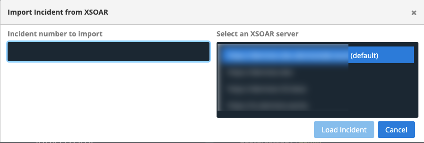
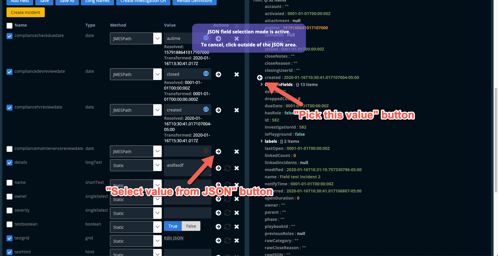
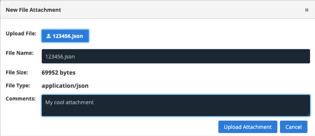
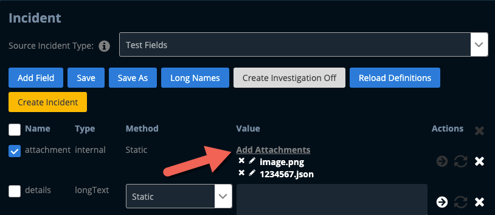
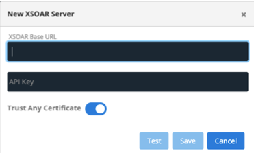

# XSOAR Incident Creator

This web application will create incidents in Cortex XSOAR (aka 'Demisto') over the XSOAR REST API.  These incidents are incidents which have either been imported from XSOAR, created by hand, or mapped from a 3rd-party JSON file.  It allows for:

- A choice of which incident fields to include.
- The ability to edit field values, including JSON data.
- The mapping of field values from valid JSON data from any source or 3rd-party product.
- The ability to parse mapped date values from numbers and formatted strings.
- File attachments to XSOAR incidents at creation time
- Bulk incident creation...
- To one or more XSOAR servers

## Security (or rather, lack of security)
- No front-end user security / login functionality is provided, so this is potentially a back-door into XSOAR if left on the network for other users to use.  See note on how **NOT** to use this app.

## How NOT to Use

- Due to the last two bullet points, this is not intended for usage amongst multiple users.  It is **strongly** recommended that you run it **ONLY** on your local workstation, for personal use.

## Warranty and Support

There is no warranty or official support for this project.  Issues will be addressed on a best-effort basis.  Use at your own risk.

## Why do I want this?

- I'm writing/testing an XSOAR playbook for either a POC or production, and I need to easily create incidents for testing, without the bother of setting up many integrations, mailboxes, configuring spam and phishing filters, writing a phishing email, etc.
- I'm an XSOAR SE or SA and I need to easily create demo incidents without the headache of configuring integrations, 3rd-party products, and ingesting the incidents.  As anyone who has tried sending emails for creating demo incidents well knows, this can consume hours of time in mucking about with email provider security, phishing, spam and malware filters, and other bother.
- I'm running an XSOAR workshop or training exercise and need the ability to push incidents to multiple students' XSOAR servers quickly.

### Weaknesses

- Error handling is admittedly a bit weak.  I'd like to make improvements to this in the future.  The browser console log will have lots of client debugging output.  The server also outputs some very basic info to the terminal.
- I'm not thrilled with the way that file attachment functionality was implemented (using a 'repo'), but it's functional.
- It does not implement any kind of websocket / live update functionality, so any changes made in other tabs or by other users will not immediately be reflected in any other tabs.
- It uses JSON files as simple databases.  Modifying them by hand may make the app unusable.
- UI doesn't yet use responsive layout, so it may look bad on small screens.

## Importing an Incident from XSOAR

Use the `XSOAR Import` button to easily load an existing incident's fields from XSOAR.  Note that this will not download file attachments from the incident.  That must be done separately.

## Using JSON for Field Values

The incident creator allows for JSON data taken from any JSON file to be utilised as the value of an incident field.  Two methods are supported.

1. Copying the values from the JSON source file directly using a GUI selector (a static value).
2. Dynamically mapping values from the incident source using a JMESPath expression.  This means that it's possible to load incident data using multiple JSON sources, as long as the JSON files' schemas match.

## JMESPath Expressions

The incident creator uses the GorillaStack implementation of JMESPath.  For information and documentation on expression usage, have a look at https://gorillastack-jmespath.netlify.app/.

## Uploading JSON Data

Use the `Upload` button under `JSON Data` to load a 3rd-party JSON file.

## File Attachments

The creator supports the upload of file attachments at incident creation time, before playbook run.  Attachments must first be uploaded to the server using the `File Attachments` button, and then attached to an incident field.  Filenames and comments can be overridden when adding a file to an incident field.

## Editing Field JSON

This app provides a text-style JSON editor for JSON-type incident fields.  The JSON must be well-formatted in order to be accepted.

## Connecting to the Application

Browse to https://localhost:4002 in your favourite web browser to launch the application.

## Generating an API Key

Before this app can be used, An API key must first be generated within Cortex XSOAR. using `Settings -> Integrations -> API Keys -> Get Your Key`.  Enter this key and the server infornation into the XSOAR Servers section of the app.  You will be prompted to do this when you first connect.

# Running in Docker

This project is distributed as a Docker image, which is the preferred method of running it.

## Note on Storing Configuration Data for Docker Containers

It's recommended that when creating or running a container, the configuration data be stored on your host filesystem rather than on the container's filesystem.  Without doing this, your configuration will be lost any time the container is removed or upgraded.  This is accomplished by creating a directory in your host profile to store the config, and then mapping it into the container with the docker command line option `-v`.  For example: 

1. Create a directory called `xsoar-incident-creator` under your home directory: `mkdir ~/xsoar-incident-creator`

2. The docker command line parameter to map that directory for Mac/Linux would be: `-v ~/xsoar-incident-creator:/opt/xsoar/xsoar-incident-creator/server/etc`
 
This will be reflected in the below command line examples.

## Running a temporary container:

**Mac/Linux:** `docker run -p 127.0.0.1:4002:4002 -ti --rm -v ~/xsoar-incident-creator:/opt/xsoar/xsoar-incident-creator/server/etc tundisto/xsoar-incident-creator:latest`

**Windows:** `docker run -p 127.0.0.1:4002:4002 -ti --rm -v c:\Users\myUsername\Documents\xsoar-incident-creator:/opt/xsoar/xsoar-incident-creator/server/etc xsoar-incident-creator:dev`

## Creating a container:

**Mac/Linux:** `docker create -p 127.0.0.1:4002:4002 --name xsoar-incident-creator -v ~/xsoar-incident-creator:/opt/xsoar/xsoar-incident-creator/server/etc tundisto/xsoar-incident-creator:latest`

**Windows:** `docker create -p 127.0.0.1:4002:4002 --name xsoar-incident-creator -v c:\Users\myUsername\xsoar-incident-creator:/opt/xsoar/xsoar-incident-creator/server/etc tundisto/xsoar-incident-creator:latest`

### Starting the container:

`docker start xsoar-incident-creator`

### Stopping the container:

`docker stop xsoar-incident-creator`

# Running In a Development Environment

The client is not distributed in pre-built form (except for the Docker image), so to run it for the first time, one must either start the Angular client in development mode or build the client using the below instructions.  If running in development mode, this means that one will have two servers running - both the Node.js server and the Angular compiler / server.

1.  Install Node.js.  This is beyond the scope of this Readme.
2.  Clone this repository by running `git clone https://github.com/tundisto/xsoar-incident-creator.git`.
3.  Install all necessary packages by running `npm install && cd server && npm install && cd ..` from the cloned project repo's root directory.
4.  Start the Node.js server by running `npm run server-dev` from the project root directory (not from the `server/` directory).
5.  In a separate terminal, start the Angular compiler from the project root using `npm start`.

## Running the Node.js server

Run `npm run server` to start the Node.js server.  If the `dist/` subdirectory is found, the pre-compiled Angular application will be served statically from it.  If `dist/` isn't found, it will run in development mode by proxying the Angular development server.

## Running the Node.js server in development mode

Use `npm run server-dev` to run the server in development mode, which will only proxy the Angular development server, rather than serving `dist/` statically.

## Running the client in development mode

Run `npm start` to start the Angular client app in development mode, allowing live-reload if making changes to the client source (found in the `src/` subdirectory).

## Building the client

Run `npm run build` to build the project in development mode.  The build artifacts will be stored in the `dist/` subdirectory. Run `npm run build-prod` for a production build.
